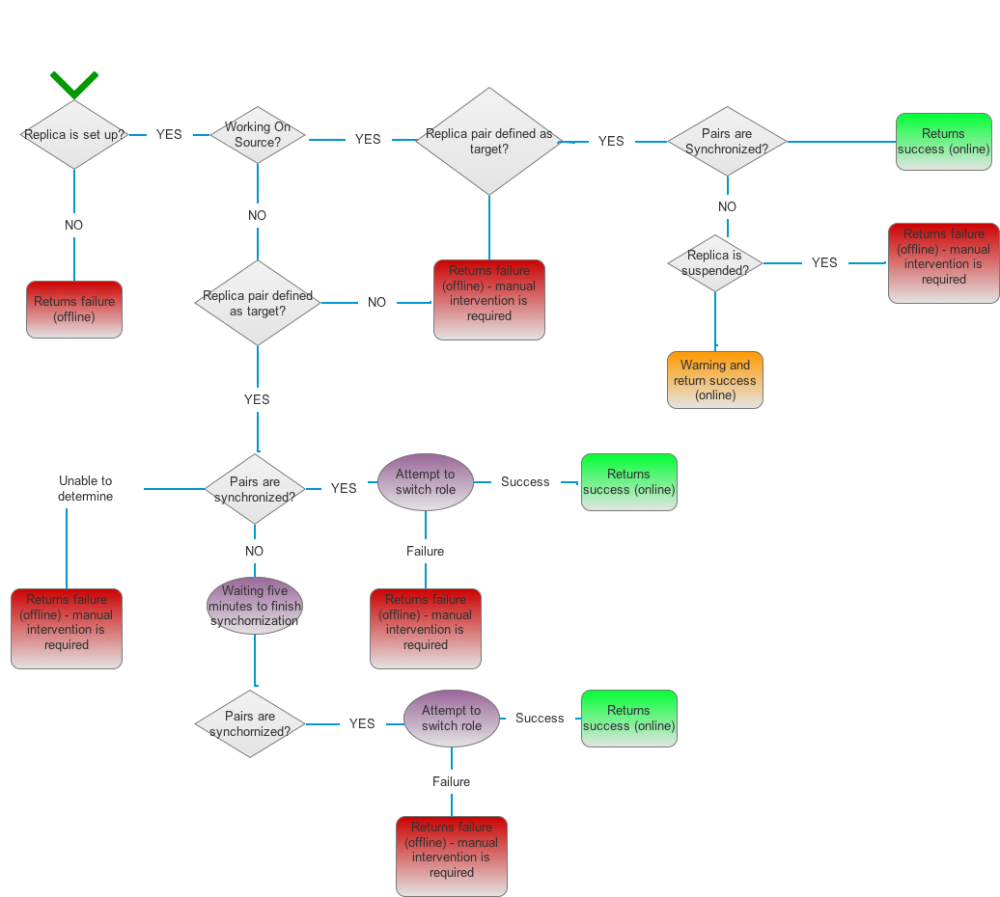

# INFINIDAT Storage Plugin for Veritas Cluster

Replication plugin to be used with Veritas cluster (aka VCS, InfoScale HA). manages synchronous replication pairs between two or more nodes, running Veritas Cluster

## Prerequisites

The Linux/AIX deployment is based on Python module of REST (REST::Client - https://metacpan.org/pod/REST::Client). the package was build with version 273 of it. resource deployment scripts include the package installation. REST Client has to be compiled with the Perl distribution released with Veritas cluster installation (VRTSperl).
With the Windows version of the plugin, InfiniBox shell (Infinishell) is being used, which can be obtained from repo.infinidat.com (version 4.0 onwards is supported)
The plugin can be installed after having Veritas Cluster installed.


## Installing

Storage plugin has to be installed on each node on the cluster. under the deployment directory, there's a shell script for installing on VCS node running on a Linux/Unix based system, and a batch script to run on a Windows based VCS node.

On Windows:
```
C:\\deployment\\addinfinidattype.bat
```

On Linux:
```
sh ./deployment/addinfinidattype.sh
```


## Available Entry-Points

The following Entry-Points are available when using this plugin:
* Reset Entry-Points, delete the resource lock file to set agent state as offline:
  * Open - Occurs when VCS engine starts
  * Close - Occurs when VCS engine terminates.
  * Clean - Occurs when VCS engine fails to starts and gets into FAULTED state.
* Control Entry-Points
  * Online - Brings the resource online (according to the table on next section), creates a lock file when replica pairs are synchronized and cluster starts on source (change roles if needed)
  * Offline - Brings the resource offline, deletes lock file.
  * Monitor - Checks whether resource online operation has finished successfully, by verifying the existance of a lock file

## Online Entry Point - startup flow



Resource startup process consist of two major steps: finding the values of replication role, link state, replica state and sync state.  Table below include the procedure taken while testing to simulate the states.

Case | Role	| Link State | Replica State | Sync State | Simulated by | Expected Result/Action
---- | ---- | ---------- | ------------- | ---------- | ------------ | --------------------------
S1	| Source | UP	| ACTIVE | SYNCHRONIZED	| | Success, Creates a lock file
S2	| Source | UP	| ACTIVE | INITIALIZING | create data on LUN / add new member to CG, rate limit on network space	| Warning, Creates a lock file
S3	| Source | UP	| ACTIVE | INITIALIZING_PENDING	| 7x pairs on state of Initializing simultaneously | Warning, Creates a lock file
S4	| Source | UP	| ACTIVE | OUT_OF_SYNC | break a link while sync (detach link)	| Warning, Creates a lock file
S5	| Source | UP   | ACTIVE | SYNC_IN_PROGRESS | reattch and write data | Warning, Creates a lock file
S6	| Source |	UP | AUTO_SUSPENDED / SUSPENDED | OUT_OF_SYNC | lock the target pool | Error, does not create lock file
S7	| Source |	UP |	Remote is also a source | OUT_OF_SYNC | suspended replica & change role | Error, does not create lock file
S8	| Source |	Down/Unable to query | AUTO_SUSPENDED | OUT_OF_SYNC | link down & wait 24 hours | Warning (Cluster should prevent data loss), create lock file
S9	| N/A	| ANY |	N/A |	N/A	| |	Fail
T1	| Target	| Up | Active | SYNCHRONIZED | | Attemts to Switch Role
T1A - Switch Role failed |	| | | | 			|		Error, do not create lock file
T1B - Switch Role success |	|	|	|	|	| Success, Create a lock file
T2 |	Target |  Up |  Active | INITIALIZING | | Wait till Sync for 300 seconds
T3 |	Target |	Up |	Active | INITIALIZING | | Wait till Sync for 300 seconds, replica sync
T4 |	Target |	Up |	Active | INITIALIZING_PENDING | | Waits till Sync for 300 seconds, repllca is not synced
T5 |	Target |	Up |	Active | INITIALIZING_PENDING | | Waits till Sync for 300 seconds, replica is synced
T6 |	Target |	Up |	Active | OUT_OF_SYNC | | Wait till Sync for 300 seconds, repllca not sync
T7 |	Target |	Up |	Active | SYNC_IN_PROGRESS | | Waits till Sync for 300 seconds
T2-5A |  After 300 seconds replica is synced | | | | | |	Switches Role
T2-5A-A - Switch role fail | | | | | | Error, does not create lock file
T2-5A-B - Switch role success | | | | |	| Success, Creates a lock file
T2-5B  After 300 seconds replica is not synced | | | | | | Error, does not create lock file
T6 |Target | Up | ANY |OUT_OF_SYNC	 | | Error, does not create lock file
T7 |Target | Up	|Remote is also a target | N/A	 | |Error, do not creates lock file
T8 |Target |N/A	| Unknown | N/A	| | Error, does not create a lock file, Manual intervention required

## Resource Attributes  
Attribure | Description | Scope 
--------- | ----------- | ------
localbox  | InfiniBox name/IP which has the replica locally attached to the VCS host | has to be defined on each VCS host seperatly
UserLocal | InfiniBox username  for the local box | can be set globally, when the same user is used for both InfiniBox  
PasswordLocal | Password for the user of the local InfiniBox |  can be set globally, when the same user password is used for both InfiniBox  
remotebox | InfiniBox name/IP which does not have the replica locally attached to the VCS host |  has to be define on each VCS host seperatly
UserRemote | InfiniBox username  for the remote box | can be set globally, when the same user is used for both InfiniBox 
PasswordRemote | Password for the user of the remote InfiniBox | can be set globally, when the same user password is used for both InfiniBox 
LocalCG | Name of the CG monitored on the local InfiniBox | has to be defined on each VCS host seperatly
RemoteCG | Name of the CG monitored on the remote InfiniBox  | has to be define on each VCS host seperatly

**Note** Passwords has to be encrypted before setting them on the resource attributes 

### Encrypting password
All passwords has to be encrypted before usage using VCS Encryption tool:

On Linux
```
/opt/VRTSvcs/bin/vcsencrypt -agent 
Enter Password: (Enter Plain Text password)
Enter Again: (Enter the same password again)
BNCnCNc
```

On Windows
```
C:\program files\veritas\cluster server\bin\vcsencrypt -agent 
Enter Password: (Enter Plain Text password)
Enter Again: (Enter the same password again)
BNCnCNc
```
Use the string returend with the attribute fields for password (PasswordLocal, PasswordRemote)

## Limitations
 
* Only Consistency groups are supported (no volumes)
* Only Sync replication is supported
* tested on Windows, AIX and Linux with VCS versions of 6.1, 6.2 and 7.3
## Authors

* **Itai Weisman** - *Genesis* 
